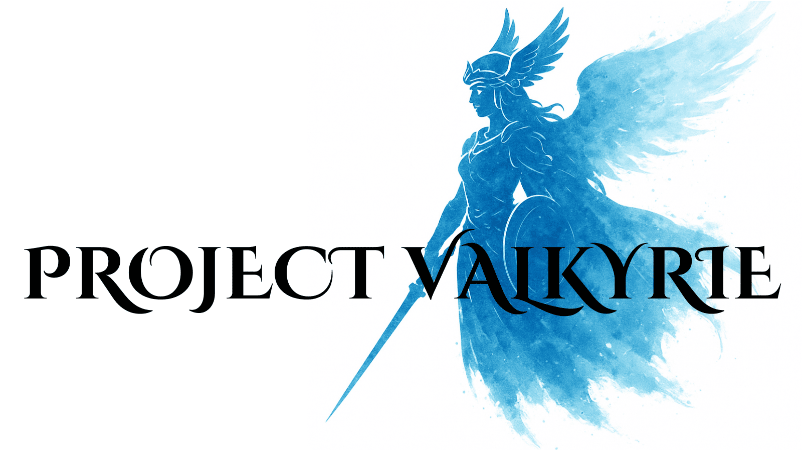

# Project Valkyrie

This repository is the public hub for:

- Player bug reports and feature suggestions (via GitHub Issues)
- Links to our community and official channels

---

## Community & Official Links

- **Website:** `<INSERT_WEBSITE_URL_HERE>`
  - Create and manage your game account
  - Access the Valky Points shop
  - View basic server info and links

- **Discord:** `<INSERT_DISCORD_INVITE_LINK_HERE>`
  - Real-time support and questions
  - Patch notes and announcements
  - Playtest and event coordination

- **Facebook Page:** `<INSERT_FACEBOOK_PAGE_URL_HERE>`
  - Public updates
  - Shareable posts and media
  - Quick overview of current events

Use Discord for conversation and quick help.
Use this GitHub repo for anything that should be tracked over time (bugs, features, balance feedback).

---

## Bug Reports & Suggestions

Use **GitHub Issues** on this repository to:

- Report bugs
- Request features
- Provide balance or gameplay feedback

When opening an issue, please include:

- A short, clear title
- What you expected to happen
- What actually happened
- Steps to reproduce the problem
- Screenshots or logs if available

NOTE: Unlabelled issues will be automatically closed. Please tag your issues correctly.

---

## License

This server uses the [rAthena](https://github.com/rathena/rathena) emulator, which is licensed under the **GNU General Public License v3.0 (GPL-3.0)**.

- rAthena code is included as a submodule and is covered by its own license.
- By using or modifying the server based on this setup, you are responsible for complying with the GPL-3.0 license terms.

See the `LICENSE` file in this repository for details on licensing of Project Valkyrie–specific content.
